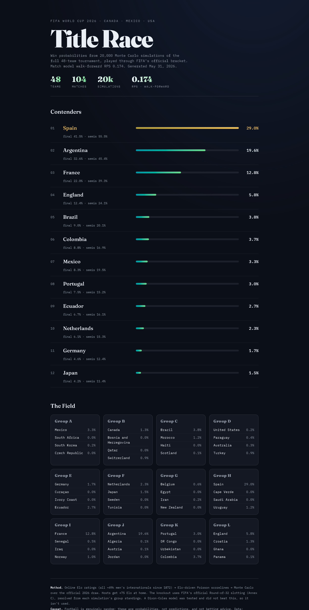
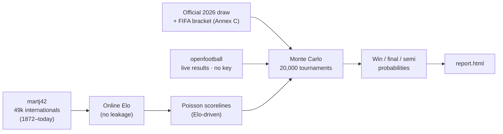

<div align="center">

# World Cup 2026 · Forecast Engine

**A probabilistic model for the first 48-team FIFA World Cup.**
Online Elo ratings → Poisson scorelines → 20,000 Monte-Carlo tournaments, run through the *official* bracket and conditioned on live results as they happen.


<br/>



</div>

---

## What it is

Most "World Cup predictors" pick a winner. This one estimates **calibrated probabilities** for every team — to win the cup, reach the final, reach the semis — and is honest about the uncertainty. It's built engine-first and validated like a forecasting model should be: against **Ranked Probability Score** on out-of-sample matches, not "did it guess the winner."

It runs **entirely for free** (no paid API), and once the tournament kicks off it **updates itself** from real results.

## The forecast

<div align="center">

| # | Team | 🏆 Champion | Final | Semis |
|---|------|:---:|:---:|:---:|
| 1 | 🇪🇸 Spain | **29.0%** | 41.5% | 55.5% |
| 2 | 🇦🇷 Argentina | **19.6%** | 32.6% | 45.4% |
| 3 | 🇫🇷 France | **12.8%** | 22.0% | 39.3% |
| 4 | 🏴󠁧󠁢󠁥󠁮󠁧󠁿 England | 5.8% | 12.4% | 24.1% |
| 5 | 🇧🇷 Brazil | 3.8% | 9.0% | 20.1% |
| 6 | 🇨🇴 Colombia | 3.7% | 8.8% | 16.9% |
| 7 | 🇲🇽 Mexico *(host)* | 3.3% | 8.3% | 19.5% |
| 8 | 🇵🇹 Portugal | 3.0% | 7.5% | 15.2% |

<sub>Full 48-team table in <code>data/processed/sim_results.csv</code> · rendered report in <a href="docs/index.html"><code>docs/index.html</code></a></sub>

</div>

## How it works



1. **Ratings** — a World-Football-style Elo computed *online* over ~49k men's internationals, so every match is rated only on information available before kickoff.
2. **Scorelines** — Elo differences drive a Poisson goal model, giving full scoreline distributions (needed for group-stage goal-difference tiebreakers).
3. **Tournament** — 20,000 simulations of the real 48-team format: 12 groups of 4, top two plus the eight best third-placed teams, then **FIFA's official Round-of-32 slotting** (the 495-combination third-place table is solved at runtime by bipartite matching — no hardcoded lookup). Hosts get a home-advantage bump.
4. **Live** — during the tournament, played matches are pulled from the public-domain `openfootball` dataset and used as *fact*; only the unplayed matches are simulated, so the forecast sharpens with reality.

## The discipline

Every modelling choice had to **earn its place against a baseline**, scored by walk-forward Ranked Probability Score (lower is better) on 11.7k out-of-sample internationals:

| model | RPS ↓ | log-loss ↓ | accuracy |
|---|:---:|:---:|:---:|
| base rate (always the prior) | 0.2285 | 1.0524 | 47.6% |
| **Elo + Poisson** *(shipped)* | **0.1736** | 0.8864 | 59.7% |
| Dixon-Coles attack/defence | 0.1770 | 0.8946 | 59.1% |

A more complex **Dixon-Coles** model was built and tested — and it *lost* to plain Elo, so it was deliberately **not shipped**. Calibration over cleverness.

> Football is genuinely random. A well-calibrated model still only "calls" ~60% of matches — these are probabilities, not predictions, and not betting advice.

## Run it

```bash
pip install -r requirements.txt
python src/ingest.py      # download ~49k internationals (once, no key)
python src/calibrate.py   # walk-forward comparison of every model
python src/simulate.py    # 20,000 tournament simulations → probabilities
python src/report.py      # render report.html
```

During the tournament, re-run `simulate.py` → `report.py` anytime; it refetches results and the forecast updates itself.

## Project layout

```
src/
  ingest.py        download canonical international results (no scraping)
  elo.py           online Elo engine
  match_model.py   Elo-driven Poisson scorelines
  dc_model.py      Dixon-Coles model (tested, didn't win — kept for the record)
  calibrate.py     rigorous walk-forward model comparison
  draw_2026.py     official 2026 draw (play-offs resolved)
  bracket.py       FIFA knockout slotting (Annex C, runtime matching)
  simulate.py      48-team Monte Carlo + live-results conditioning
  report.py        renders the HTML report
  live.py          openfootball results (free) + API-Football layer
```

## Design notes

The report isn't a default dashboard. It commits to a direction: a dark editorial broadsheet, **Fraunces** for display against **IBM Plex Mono** for figures, an OKLCH palette with a single teal→gold accent carrying the probability bars, generous negative space, and zero gratuitous motion. Typography and hierarchy do the work; the numbers are the art.

## Data & credits

- [martj42/international_results](https://github.com/martj42/international_results) — international match history (CC0)
- [openfootball/worldcup.json](https://github.com/openfootball/worldcup.json) — 2026 schedule & results (public domain)
- Method stands on the shoulders of [Dixon & Coles (1997)](https://dashee87.github.io/football/python/predicting-football-results-with-statistical-modelling-dixon-coles-and-time-weighting/) and the World Football Elo system.

## License

[MIT](LICENSE) © 2026 Mohamed Aziz Selmi
